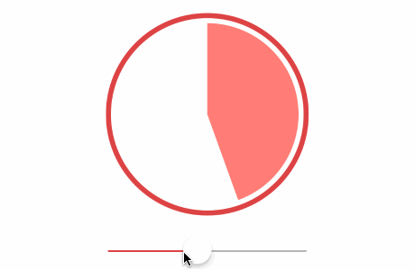

# TKSectorProgressView
> An simple animation sector progress view

[![Swift Version][swift-image]][swift-url]
[](https://raw.githubusercontent.com/TBXark/TKSectorProgressView/master/LICENSE)
[](http://cocoapods.org/?q= TKSectorProgressView)
[](http://cocoapods.org/?q= TKSectorProgressView)
[](https://www.apple.com/nl/ios/)

One to two paragraph statement about your product and what it does.



## Requirements

- iOS 8.0+
- Xcode 7.3

## Installation

#### CocoaPods
You can use [CocoaPods](http://cocoapods.org/) to install `TKSectorProgressView` by adding it to your `Podfile`:

```ruby
platform :ios, '8.0'
use_frameworks!
pod 'TKSectorProgressView'
```

To get the full benefits import `TKSectorProgressView` wherever you import UIKit

``` swift
import UIKit
import TKSectorProgressView
```
#### Carthage
Create a `Cartfile` that lists the framework and run `carthage update`. Follow the [instructions](https://github.com/Carthage/Carthage#if-youre-building-for-ios) to add `$(SRCROOT)/Carthage/Build/iOS/TKSectorProgressView.framework` to an iOS project.

```
github "tbxark/TKSectorProgressView"
```
#### Manually
1. Download and drop ```TKSectorProgressView.swift``` in your project.  
2. Congratulations!  

## Usage example

```swift
import TKSectorProgressView


let progress = TKSectorProgressView(frame: CGRect(x: 0, y: 0, width: 200, height: 200))

progress.configure.borderColor = UIColor(red:0.862,  green:0.272,  blue:0.282, alpha:1)
progress.configure.fillColor = UIColor.whiteColor()
progress.configure.sectorColor = UIColor(red:1,  green:0.493,  blue:0.474, alpha:1)
progress.configure.borderWidth = 5
progress.configure.innerInset CGFloat = 5
progress.animateDuration = 2

progress.setProgress(1, animate: true)

```


## Release History

* 1.0
  Complete basic functions, add Cocoapod support

## Contribute

We would love for you to contribute to **TKSectorProgressView**, check the ``LICENSE`` file for more info.

## Meta

TBXark – [@vfanx](https://twitter.com/vfanx) – tbxark@outlook.com

Distributed under the MIT license. See ``LICENSE`` for more information.

[https://github.com/TBXark](https://github.com/TBXark)

[swift-image]:https://img.shields.io/badge/swift-3.0-orange.svg
[swift-url]: https://swift.org/
[license-image]: https://img.shields.io/badge/License-MIT-blue.svg
[license-url]: LICENSE
[travis-image]: https://img.shields.io/travis/dbader/node-datadog-metrics/master.svg?style=flat-square
[travis-url]: https://travis-ci.org/dbader/node-datadog-metrics
[codebeat-image]: https://codebeat.co/badges/c19b47ea-2f9d-45df-8458-b2d952fe9dad
[codebeat-url]: https://codebeat.co/projects/github-com-vsouza-awesomeios-com
